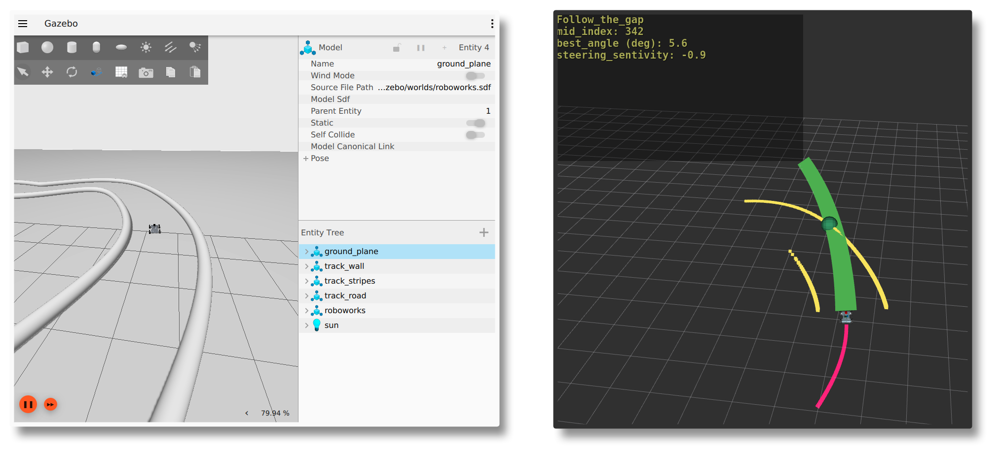
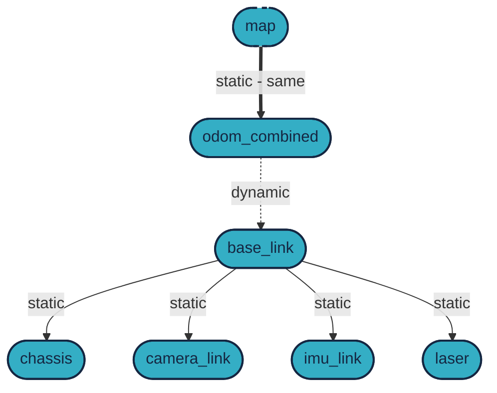

# `megoldas_sim24` package
# ROS 2 Python Package [](https://docs.ros.org/en/humble/)


## Packages and Build

It is assumed that the workspace is `~/ros2_ws/`.

### Clone the Packages

```bash
cd ~/ros2_ws/src
```
```bash
git clone https://github.com/robotverseny/megoldas_sim24
```

### Rviz 2D Overlay

```bash
sudo apt install ros-humble-rviz-2d-overlay*
```

### Build ROS 2 Packages

```bash
cd ~/ros2_ws
```
```bash
colcon build --packages-select megoldas_sim24 --symlink-install
```

### Run the ROS 2 Packages

<details>
<summary>Don't forget to source before ROS commands.</summary>

```bash
source ~/ros2_ws/install/setup.bash
```
</details>

```bash
ros2 launch megoldas_sim24 megoldas1.launch.py # start simple_pursuit
```
```bash
ros2 run megoldas_sim24 simple_pursuit.py
```
```bash
ros2 launch megoldas_sim24 megoldas2.launch.py # start follow_the_gap
```
```bash
ros2 run megoldas_sim24 follow_the_gap.py
```

### Run the simulator

> [!TIP]
> Use the `megoldas_sim24` package with the [`robotverseny_gazebo24`](https://github.com/robotverseny/robotverseny_gazebo24/) simulator.

Build and run instructions of the simulator is described in the [`robotverseny_gazebo24`](https://github.com/robotverseny/robotverseny_gazebo24/) package.

**After** the simulaton packages are built and sourced, you can start the simulator, e.g. with the following command:

```bash
ros2 launch robotverseny_bringup roboworks.launch.py rviz:=true
```



## Joystick Teleop Launch

This section explains how to use the `joystick` teleop to control your car using a `joystick`.

### Install the `joy` Package

Ensure that the `joy` package is installed:

```bash
sudo apt-get install ros-humble-joy
```

### Run the Joystick Teleop Launch File

To start the `joystick teleop node`, use the following command:

```bash
ros2 launch megoldas_sim24 car_teleop_launch.py
```

This will launch the `joystick_teleop_node` and `joy_node` nodes, allowing you to control your car using a `joystick`.

### Joystick Controls

- **Left Stick Vertical Axis**: Controls the linear speed of the car.
- **Left Stick Horizontal Axis**: Controls the angular speed of the car.

Adjust the parameters in the `joystick_teleop.py` file as needed based on your **joystick configuration and desired control behavior**.

> **Tip**: Check out `joy_tester` for configuring your joystick.

## Transformations

The frame `/odom_combined` is practically the same as `/map`, there is a static `0,0,0` transform between them. The only dynamic transform is between `/odom_combined` and `/base_link`.




## License

This project is licensed under the GNU General Public License v3.0 - see the LICENSE file for details.
